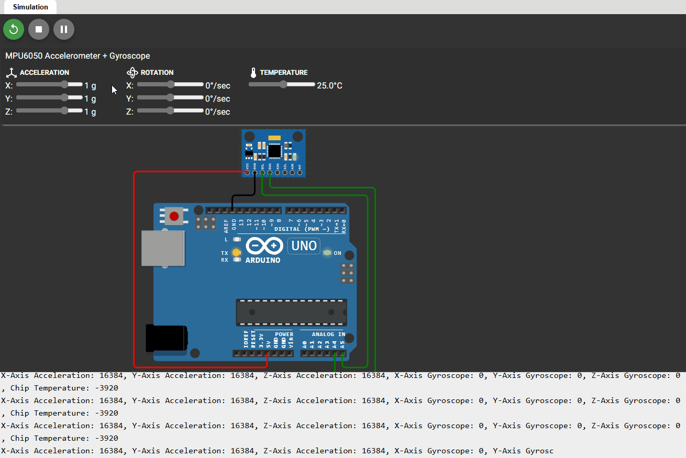

# 🧭 3-Axis Gyroscope & Accelerometer Measurement using MPU6050 and Arduino

This project demonstrates how to interface an MPU6050 6-axis motion sensor (3-axis accelerometer + 3-axis gyroscope) with an Arduino using I²C communication. The sensor data is read, decoded, and printed to the Serial Monitor in a structured, human-readable format.



---

## 🚀 Features

- 🔌 I²C communication via the built-in `Wire` library  
- 📈 Reads raw 16-bit signed accelerometer and gyroscope data for all axes  
- 🖥️ Displays sensor data in labeled format using `Serial.print()`  
- 🧪 Simulated and tested in the [Wokwi online Arduino environment](https://wokwi.com)  
- 🎯 Ideal for beginners learning sensor interfacing, signed data handling, and I²C

---

## 📁 Repository Contents

- `MPU6050_Reader.ino` – The main Arduino sketch  
- `mpu6050_simulation.gif` – GIF showing live simulation of sensor readings  
- `3-Axis-Gyroscope-Accelerometer-Measurement.zip` – Includes the code and Wokwi project file  
- `README.md` – This file  

---

## 📦 Setup Instructions

### 🔧 Hardware (Simulated in Wokwi)
- **Arduino Uno**
- **MPU6050 sensor module**
  - SDA → A4  
  - SCL → A5  
  - VCC → 5V  
  - GND → GND

### 🧰 Software
- Arduino IDE
- `Wire.h` library (included by default)
- [Wokwi Arduino Simulator](https://wokwi.com)

### 📜 Upload Instructions
1. Open the `.ino` file in Arduino IDE or Wokwi.
2. Upload to your board or run in the simulator.
3. Open the Serial Monitor to view live sensor data.

---

## 📊 Output Format

The output in the Serial Monitor looks like this:
```
X-Axis Acceleration: -245, Y-Axis Acceleration: 16384, Z-Axis Acceleration: 512,
X-Axis Gyroscope: 0, Y-Axis Gyroscope: 200, Z-Axis Gyroscope: -87
```

---

## 📐 Why the Output Values Make Sense

The MPU6050 outputs data in **signed 16-bit format**, where:

- The raw output range is from **-32768 to +32767**
- At ±2g accelerometer scale:
  - **1g ≈ 16384**
  - **2g ≈ 32768 (maximum value)**

So in the GIF, if you see an acceleration value close to ±16384, it indicates approximately ±1g — consistent with gravity when the sensor is still or tilted. Similarly, gyroscope values reflect angular velocity in raw counts that correspond to °/s after scaling.

**Formula used for scaling:**
```cpp
g_force = raw_accel_value / 16384.0;
deg_per_sec = raw_gyro_value / 131.0;
```

---

## 🌐 Live Simulation (Wokwi)

You can simulate this project directly in Wokwi using the files provided in the ZIP.

---

## ⏳ Future Improvements

- Scale raw 16-bit signed values to an SI equivalent.
- Add a second MPU6050 sensor for redundancy.
- Explore using higher speed baud rates for communication.
  
---

## 📘 License

This project is open-source and available under the [MIT License](LICENSE) (if applicable).

---

## 🙌 Acknowledgments

Special thanks to the creators of the [MPU6050 datasheet](https://invensense.tdk.com/products/motion-tracking/6-axis/mpu-6050/) and the [Wokwi Simulator](https://wokwi.com) community.

---

## 👤 Author

> Created by Yasteer Sewpersad

> Electronic Engineering Portfolio of Evidence

